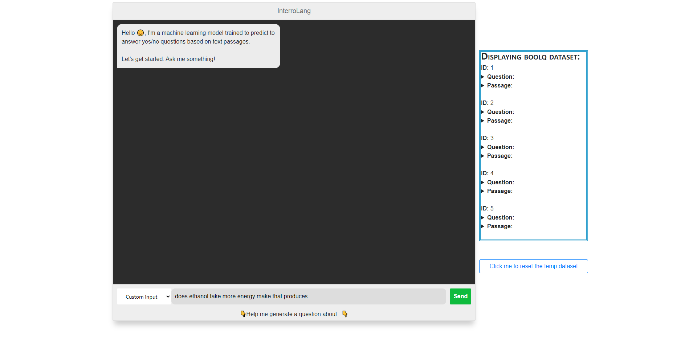
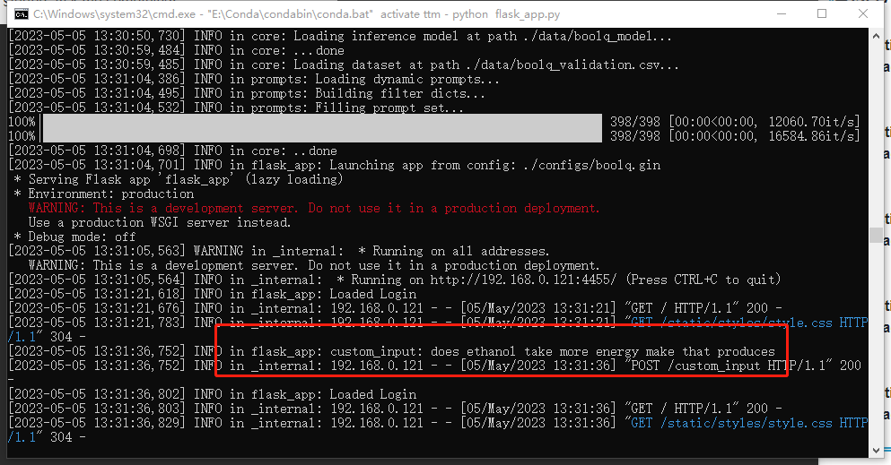
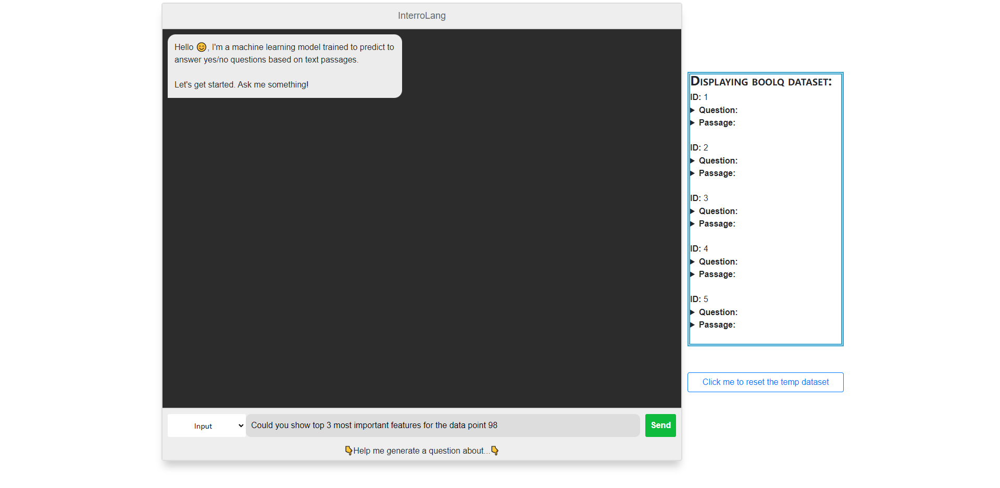
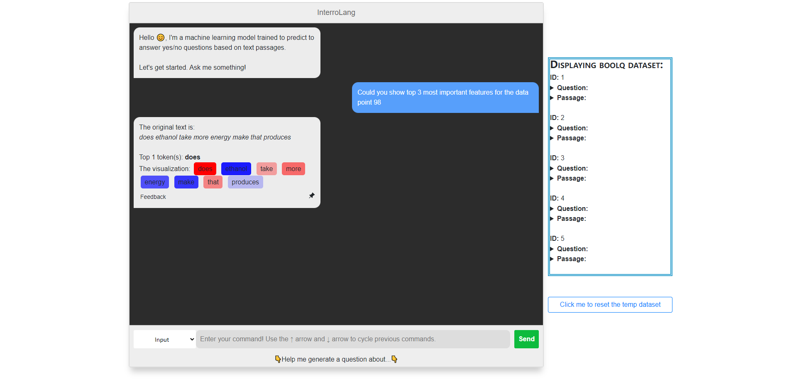

<p align="center">

</p>

# InterroLang

TalkToModel (Slack et al., 2022) adaptation to NLP use cases (question answering, hate speech detection, dialogue act classification).


## Running with conda / virtualenv

Create the environment and install dependencies.

```shell
conda create -n ttm python=3.9
conda activate ttm
```

Install the requirements
```shell
pip install -r requirements.txt
```

Download datasets (only **BoolQ** for now!) by running
```python
python get_data.py
```

Download the model from [Hugging Face](https://huggingface.co/andi611/distilbert-base-uncased-qa-boolq/tree/main)  
and put it under _/configs_ as _./configs/boolq_model_.

You can launch the Flask web app via
```python
python flask_app.py
```


## Datasets / Use cases
* Question Answering (BoolQ)
* Hate Speech Detection (OLID)
* Dialogue Act Classification (DailyDialog)

## Explanation modules
* Feature Attribution (feature_importance)
* Counterfactual Generation (counterfactuals)
* Similar Examples (similarity)

## Data modules
* Filtering (utils)

## How to get used models?
- BoolQ model: https://huggingface.co/andi611/distilbert-base-uncased-qa-boolq
- OLID model: https://huggingface.co/sinhala-nlp/mbert-olid-en

## How to use custom input?
### Supported operations
1. nlpattribute
2. prediction

### Process
#### 1. Enter your custom input in the text area and then click send button. Be aware: you have to choose **"Custom input"** in the selection box.


#### 2. After clicking the button, you could see your custom input in the terminal


#### 3. Then you should enter prompts for operations mentioned above. Here, as example, we choose nlpattribute.


#### 4. In the end, click the send button and you will get the result.



## How to get used models?
- BoolQ model: https://huggingface.co/andi611/distilbert-base-uncased-qa-boolq
- OLID model: https://huggingface.co/sinhala-nlp/mbert-olid-en

