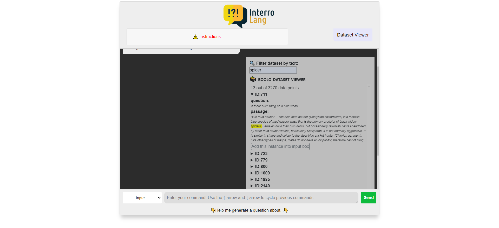
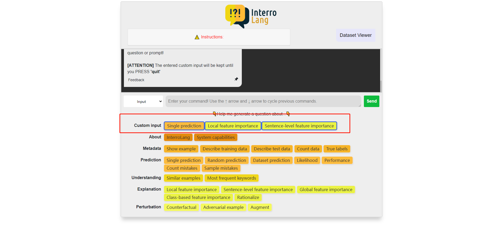
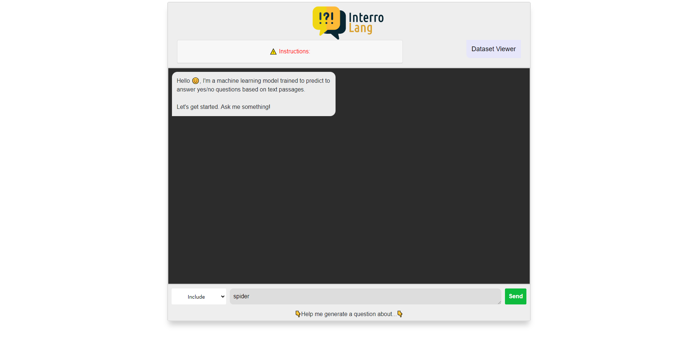

<p align="center">

</p>


[](./actions/workflows/github.yml/badge.svg)

# InterroLang

A [TalkToModel (Slack et al., 2022)](https://github.com/dylan-slack/TalkToModel) adaptation to NLP use cases (question answering, hate speech detection, dialogue act classification).  
The name is a word-play on [Interrobang](https://en.wikipedia.org/wiki/Interrobang), a ligature of question mark and exclamation mark, and the **interro**gation of **Lang**uage models.  
Our tool offers a dialogue-based exploration of NLP interpretability methods (feature attribution, counterfactuals and perturbations, free-text rationalization) and dataset analyses (similar examples, keywords, label distribution).

<p align="center">
&nbsp;&nbsp;&nbsp;

</p>

## InterroLang Interface

We consider 7 categories of operations.
- About: Capabilities of our system.
- Metadata: Information in terms of data, model, labels.
- Prediction: Various operations related to gold labels and model predictions.
- Understanding: Keyword-based analysis and retrieval of similar instances.
- Explanation: Feature attribution methods (local-, class-, global-level) and free-text rationalization.
- Perturbation: Methods to change some parts of an instance, e.g. such that the label of the instance would change.
- Custom input: We not only allow instances from the dataset but also instances given by users. (More details see [below](#process))

They are defined in [actions](./actions) and [prompts](./prompts).  

### Dataset Viewer
We provide a dataset view with which users can explore instances contained in the pre-defined dataset (in screenshot, BoolQ dataset is used). Users can search instances that include the entered string. 


## Datasets / Use cases
* Question Answering ([BoolQ](https://huggingface.co/datasets/boolq))
* Hate Speech Detection ([OLID](https://scholar.harvard.edu/malmasi/olid))
* Dialogue Act Classification ([DailyDialog](https://huggingface.co/datasets/daily_dialog))


## Running with conda / virtualenv

### Create the environment and install dependencies.

#### Conda
```shell
conda create -n interrolang python=3.9
conda activate interrolang
```

#### venv
```shell
python -m venv venv
source venv/venv/activate
```

### Install the requirements
```shell
python -m pip install --upgrade pip
pip install -r requirements.txt

# Download omw-1.4
python -m nltk.downloader omw-1.4

# Punkt
python -m nltk.downloader punkt

# Install spacy
pip install -U pip setuptools wheel
pip install -U spacy
python -m spacy download en_core_web_sm
```
Install [polyjuice-nlp](https://github.com/tongshuangwu/polyjuice) and its dependencies due to some [issues](https://github.com/tongshuangwu/polyjuice/issues/10) from polyjuice:
```bash
cd utils
bash dependency.sh
```

### Download models
In our tool, we currently use the following Transformer models: 

- DistilBERT fine-tuned on BoolQ: https://huggingface.co/andi611/distilbert-base-uncased-qa-boolq (HF)
- MultiBERT fine-tuned on OLID: https://huggingface.co/sinhala-nlp/mbert-olid-en (HF)
- BERT fine-tuned on DailyDialog: Due to anonymization not shown any links

#### For BoolQ and OLID Model:
Put them under `./data` and name the folders `boolq_model` and `olid_model` respectively.

#### For Daily Dialog model:
Put the file `5e_5e-06lr` under `./explained_models/da_classifier/saved_model`


### Set up configuration
In `./configs`, there are all gin config files for all three datasets with different parsing models. You can choose one of them and set its path in `./global_config.gin`:
```
GlobalArgs.config = "./configs/boolq_adapter.gin"
```

### Run the application
You can launch the Flask web app via
```python
python flask_app.py
```


## Running with Docker

If you want to run with Docker, you can build the docker app
```bash
sudo docker build -t interrolang .
```

And then run the image
```bash
sudo docker run -d -p 4000:4000 interrolang
```

## User Guide
After the project is set up, we provide an optional [user guide](./utils/user_guide.py) using Selenium to demonstrate how to use our system if you have a Chrome Browser available.

## How to use custom input
### Supported operations
1. Feature importance on token level
2. Feature importance on sentence level
3. Prediction
4. Similarity
5. Rationalization

### Process
#### 1. Enter your custom input in the text area and then click send button. Be aware: you have to choose **"Custom input"** in the selection box.


#### 2. After clicking the button, you could see your custom input in the terminal


#### 3. Then you should enter prompts for operations mentioned above. Operations that support custom input are highlighted with yellow border.


#### 4. In the end, click the send button and you will get the result. (In this example, we show the result of feature importance on token level on given custom input)


## How to use include operation
Include operation works similar to [custom input](#how-to-use-custom-input)
1. Enter a single token in the text area and choose **"Include""** in the selection box. Then click the send button.

2. After clicking the button, you could see your entered token in the interface.

3. Then you could enter a prompt (refer [here](./prompts/filter))
   - Supported operations:
     - countdata
     - label
     - mistake
     - predict
     - score
     - show