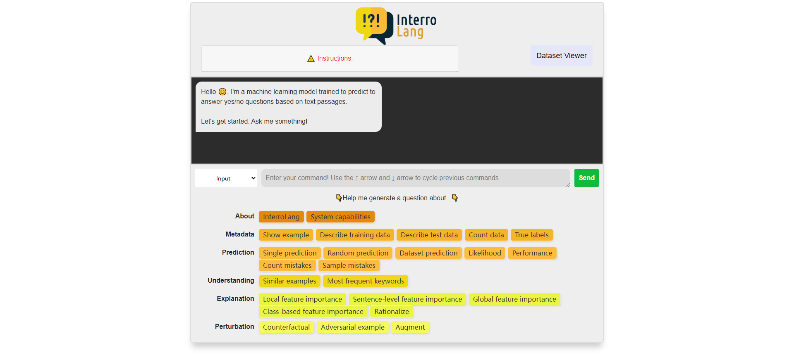
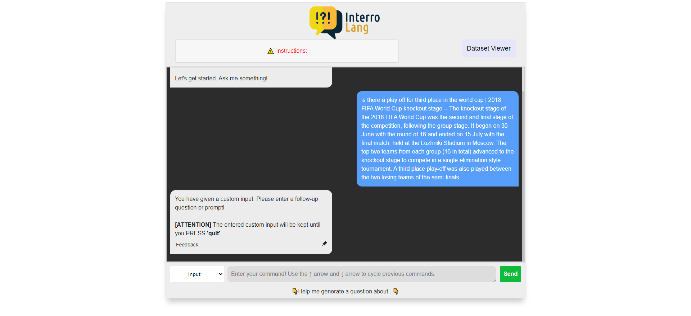

<p align="center">

</p>

# InterroLang

TalkToModel (Slack et al., 2022) adaptation to NLP use cases (question answering, hate speech detection, dialogue act classification).

## InterroLang Interface

We consider 7 categories of operations.
- About: capabilities of our system.
- Metadata: information in terms of data, model, label.
- Prediction: various operations related to golden labels and predictions.
- Understanding: find some similar instances.
- Explanation: different kinds of methods to explain an instance / dataset.
- Custom input: we not only allow instances from the dataset but also instances given by user. (More details see [below](https://github.com/nfelnlp/InterroLang#process))
- Perturbation: operations would change some parts of instance such that the label of the instance would change.  

### Dataset Viewer
We provide a dataset view, with which user can explore instances containing in the current dataset (in screenshot, BoolQ dataset is used). User can enter a token to search instances that include the entered token. 


## Datasets / Use cases
* Question Answering ([BoolQ](https://huggingface.co/datasets/boolq))
* Hate Speech Detection ([OLID](https://scholar.harvard.edu/malmasi/olid))
* Dialogue Act Classification ([DailyDialog](https://huggingface.co/datasets/daily_dialog))


## Running with conda / virtualenv

### Create the environment and install dependencies.

#### Conda
```shell
conda create -n interrolang python=3.9
conda activate interrolang
```

#### Venv
```shell
python -m venv venv
source venv/venv/activate
```

### Then install the requirements
```shell
python -m pip install --upgrade pip
pip install -r requirements.txt

# Needed for some operations
python -m nltk.downloader omw-1.4
python -m nltk.downloader punkt
```

### Download models
### How to get used models?
- BoolQ model: https://huggingface.co/andi611/distilbert-base-uncased-qa-boolq
- OLID model: https://huggingface.co/sinhala-nlp/mbert-olid-en
- Daily Dialog model: https://cloud.dfki.de/owncloud/index.php/s/m72HGNLW2TyCABr

#### For BoolQ and OLID Model:
Put them under `./data` and name the folders `boolq_model` and `olid_model` respectively.

#### For Daily Dialog model:
Put the file `5e_5e-06lr` under `./explained_models/da_classifier/saved_model`

### Set up configuration
In `./configs`, there are all gin config files for all three datasets with different parsing models. You can choose one of them and set its path in `./global_config.gin`:
```
GlobalArgs.config = "./configs/boolq_adapter.gin"
```

### Run the application
You can launch the Flask web app via
```python
python flask_app.py
```


## How to use custom input?
### Supported operations
1. feature importance on token level
2. feature importance on sentence level
3. prediction
4. similarity
5. rationalization

### Process
#### 1. Enter your custom input in the text area and then click send button. Be aware: you have to choose **"Custom input"** in the selection box.


#### 2. After clicking the button, you could see your custom input in the terminal


#### 3. Then you should enter prompts for operations mentioned above. Operations that support custom input are highlighted with yellow border.


#### 4. In the end, click the send button and you will get the result. (In this example, we show the result of feature importance on token level on given custom input)


